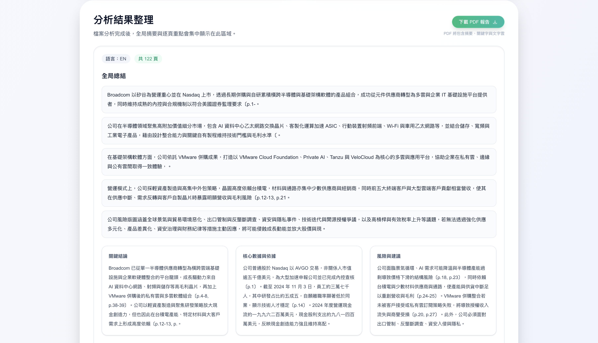
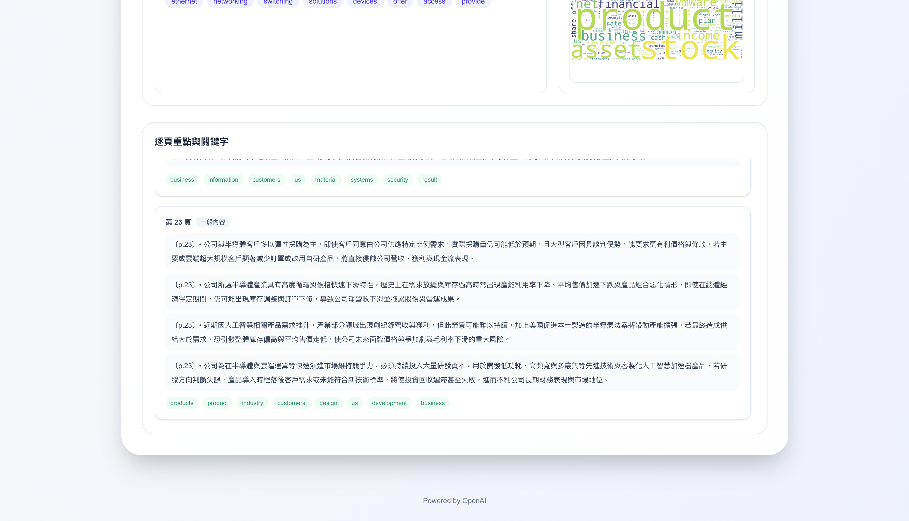

# AutoNote&Slide - 技術文檔

[](https://autonote.up.railway.app)

**📋 專案概述**

**AutoNote&Slide** 是一個智能文件分析與摘要生成系統，能自動將 PDF 文件轉換為結構化的摘要報告，並生成視覺化的文字雲。系統支援多語言文檔分析。

**核心功能**：
- 📄 PDF 文件上傳與解析
- 🤖 AI 驅動的分頁摘要生成
- 📊 全局重點彙整（結論、數據、風險、行動建議）
- 🏷️ 關鍵字自動提取
- ☁️ 文字雲視覺化
- 📑 專業 PDF 報告匯出

## 📸 功能展示

### 上傳介面


### 分析結果展示


### 文字雲與摘要報告


## 🏗️ 系統架構

### 整體架構圖

```
┌─────────────────┐         ┌─────────────────┐
│                 │   HTTP  │                 │
│  Next.js 前端   │ ◄─────► │  FastAPI 後端   │
│   (React 19)    │         │   (Python 3.x)  │
│                 │         │                 │
└─────────────────┘         └─────────────────┘
        │                           │
        │                           ├─► PDF 解析 (PyMuPDF)
        │                           ├─► NLP 處理 (jieba, nltk)
        │                           ├─► LLM 摘要 (OpenAI API)
        │                           └─► 文字雲生成 (wordcloud)
        │
        └─► PDF 報告生成 (pdf-lib)
```

### 技術棧分層

| 層級 | 前端 | 後端 |
|------|------|------|
| **框架** | Next.js 15.5.4 + React 19 | FastAPI + Uvicorn |
| **語言** | TypeScript 5 | Python 3.x |
| **樣式** | Tailwind CSS 4 | - |
| **狀態管理** | React Hooks | Pydantic Models |
| **HTTP 客戶端** | Fetch API | HTTPX (via OpenAI SDK) |
| **AI/ML** | - | OpenAI API |
| **NLP** | - | jieba, nltk, langdetect |
| **文件處理** | pdf-lib | PyMuPDF (fitz), pymupdf4llm, **Marker** |
| **部署** | Docker + Next.js standalone | Docker + Uvicorn |

## 🔧 核心技術詳解

### 1. 前端架構 (Next.js)

#### 1.1 專案結構

```
frontend/
├── src/
│   ├── app/
│   │   ├── layout.tsx          # 根佈局
│   │   ├── page.tsx            # 首頁（上傳介面）
│   │   └── globals.css
│   └── lib/
│       └── generateAnalysisPdf.ts  # PDF 報告生成
├── public/                     # 靜態資源
├── package.json
└── Dockerfile
```

#### 1.2 前端架構設計

**組件架構**

```
┌─────────────────────────────────────────┐
│           app/page.tsx                   │  ← 主頁面組件
│                                          │
│  ┌────────────────────────────────────┐ │
│  │   上傳區 (Upload Zone)              │ │
│  │   - 檔案拖放                         │ │
│  │   - 參數配置                         │ │
│  │   - API Key 輸入                    │ │
│  └────────────────────────────────────┘ │
│                                          │
│  ┌────────────────────────────────────┐ │
│  │   進度顯示區 (Progress Display)     │ │
│  │   - 即時進度條                       │ │
│  │   - 狀態訊息                         │ │
│  └────────────────────────────────────┘ │
│                                          │
│  ┌────────────────────────────────────┐ │
│  │   結果展示區 (Result Display)       │ │
│  │   - 摘要內容                         │ │
│  │   - 文字雲圖片                       │ │
│  │   - PDF 下載按鈕                    │ │
│  └────────────────────────────────────┘ │
└─────────────────────────────────────────┘
```

**狀態管理流程**

```
React State (useState)
│
├─► selectedFile: File | null          ← 上傳檔案
├─► apiKey: string                     ← API Key
├─► baseUrl: string                    ← API 端點
├─► analysisLevel: 'light'|'medium'|'deep'  ← 分析深度
├─► enableVision: boolean               ← Vision 開關
│
├─► isAnalyzing: boolean                ← 分析狀態
├─► progress: number                    ← 進度 (0-100)
├─► statusMessage: string               ← 狀態訊息
│
└─► analysisResult: AnalysisData        ← 分析結果
```

**數據流程**

```
1. 用戶上傳檔案
        ↓
2. 前端驗證 (格式、大小)
        ↓
3. 構建 FormData
        ↓
4. 發送 POST /api/analyze
        ↓
5. 接收 NDJSON Stream
        │
        ├─► 解析進度事件 → 更新 UI
        └─► 解析結果事件 → 儲存結果
        ↓
6. 顯示分析結果
        ↓
7. 生成 PDF 報告 (generateAnalysisPdf)
        ↓
8. 下載 PDF
```

**核心功能模組**

| 模組 | 職責 | 技術實現 |
|------|------|----------|
| **檔案上傳** | 處理 PDF 上傳 | Drag & Drop API、File API |
| **串流處理** | 解析 NDJSON 串流 | ReadableStream API、TextDecoder |
| **進度追蹤** | 即時進度顯示 | React State、useEffect |
| **PDF 生成** | 建立摘要報告 | pdf-lib、標準字型 |
| **錯誤處理** | 異常捕獲與提示 | try-catch、錯誤狀態 |

#### 1.3 關鍵技術實現

**即時進度顯示**
```typescript
// NDJSON 串流解析
const decoder = new TextDecoder();
const reader = response.body.getReader();

while (true) {
  const { done, value } = await reader.read();
  if (done) break;
  
  const chunk = decoder.decode(value);
  const events = chunk.split('\n').filter(Boolean);
  
  for (const event of events) {
    const data = JSON.parse(event);
    if (data.type === 'progress') {
      setProgress(data.progress);
    }
  }
}
```

**PDF 報告生成**
- 使用 `pdf-lib` 建構 PDF
- 支援中文字型嵌入
- 包含文字雲圖片
- 自動分頁與排版

### 2. 後端架構 (FastAPI)

#### 2.1 專案結構

```
backend/
├── app/
│   ├── main.py                 # FastAPI 應用入口
│   ├── core/
│   │   ├── config.py          # 配置管理
│   │   └── llm_client.py      # LLM 客戶端封裝
│   ├── models/
│   │   └── schemas.py         # Pydantic 數據模型
│   ├── routes/
│   │   ├── analyze.py         # 分析 API
│   │   └── health.py          # 健康檢查
│   ├── services/
│   │   ├── analyze/           # 分析服務
│   │   │   ├── summary_engine.py      # 摘要引擎
│   │   │   ├── page_classifier.py     # 頁面分類器
│   │   │   ├── page_parser.py         # 頁面解析器
│   │   │   ├── image_extractor.py     # 圖片提取器
│   │   │   └── vision_analyzer.py     # Vision API 分析器
│   │   ├── nlp/               # NLP 服務
│   │   │   ├── language_detect.py     # 語言偵測
│   │   │   ├── keyword_extractor.py   # 關鍵字提取
│   │   │   └── segmenter.py           # 文本分段
│   │   ├── parsing/           # 檔案解析
│   │   │   └── parse_pdf.py           # PDF 解析
│   │   ├── wordcloud/         # 文字雲生成
│   │   │   └── wordcloud_gen.py
│   │   └── storage.py         # 檔案儲存
│   └── utils/
│       └── text_clean.py      # 文本清理工具
├── assets/                    # 字型資源
├── requirements.txt
└── Dockerfile
```

#### 2.2 後端架構設計

**分層架構**

```
┌─────────────────────────────────────────┐
│         API Layer (routes/)              │  ← HTTP 端點層
├─────────────────────────────────────────┤
│       Service Layer (services/)          │  ← 業務邏輯層
│  ┌─────────┬─────┬─────────┬──────────┐ │
│  │ analyze │ nlp │ parsing │ wordcloud│ │
│  └─────────┴─────┴─────────┴──────────┘ │
├─────────────────────────────────────────┤
│     Core Layer (core/)                   │  ← 核心基礎設施
│  ┌────────────┬──────────────────────┐  │
│  │   config   │   llm_client         │  │
│  └────────────┴──────────────────────┘  │
├─────────────────────────────────────────┤
│     External APIs                        │  ← 外部服務
│  ┌────────────┬──────────────────────┐  │
│  │  OpenAI    │   Vision API         │  │
│  └────────────┴──────────────────────┘  │
└─────────────────────────────────────────┘
```

**請求處理流程**

```
1. 客戶端上傳 PDF
        ↓
2. API 路由層接收 (routes/analyze.py)
        ↓
3. 檔案儲存 (services/storage.py)
        ↓
4. PDF 解析 (services/parsing/parse_pdf.py)
        ↓
5. 頁面分類 (services/analyze/page_classifier.py)
        ↓
6. 並發生成摘要 (services/analyze/summary_engine.py)
        │
        ├─► LLM API 調用 (core/llm_client.py)
        └─► Vision API 調用 (services/analyze/vision_analyzer.py)
        ↓
7. 全局摘要彙整 (services/analyze/summary_engine.py)
        ↓
8. 關鍵字提取 (services/nlp/keyword_extractor.py)
        ↓
9. 文字雲生成 (services/wordcloud/wordcloud_gen.py)
        ↓
10. 返回結果 (Streaming Response)
```

**核心服務模組**

| 模組 | 職責 | 關鍵技術 |
|------|------|----------|
| **summary_engine** | 摘要生成引擎 | 異步並發、進度追蹤、錯誤處理 |
| **page_classifier** | 智能頁面分類 | 規則引擎、內容分析 |
| **llm_client** | LLM 統一接口 | OpenAI SDK、重試機制、速率控制 |
| **keyword_extractor** | 關鍵字提取 | jieba (中文)、NLTK (英文)、TF-IDF |
| **wordcloud_gen** | 文字雲生成 | PIL、中文字型支援、Base64 編碼 |
| **parse_pdf** | PDF 解析 | PyMuPDF、文字提取、圖片提取 |

#### 2.3 關鍵技術決策

**API 設計 - Streaming Response**
- 使用 `StreamingResponse` 實現即時進度更新
- 採用 NDJSON (Newline Delimited JSON) 格式
- 前端可即時顯示處理進度

```python
# 範例：進度事件流
{"type": "progress", "progress": 12, "message": "檔案儲存完成"}
{"type": "progress", "progress": 35, "message": "頁面判定完成"}
{"type": "progress", "progress": 90, "message": "完成第 150/150 頁摘要"}
{"type": "result", "progress": 100, "data": {...}}
```

**LLM 整合策略**
- 支援多模型配置
- 自動速率限制 (OpenAI SDK 內建重試)
- 高並發處理（可調整並發數）

**智能頁面分類**
- 自動跳過無意義頁面：
  - 封面頁、目錄頁
  - 純圖片頁、照片頁
  - 參考文獻頁
  - 空白頁


#### 2.4 核心演算法

**摘要生成流程**

```python
# 1. 文檔解析
pages = parse_pages(pdf_path)

# 2. 頁面分類
classified_pages = [classify_page(p) for p in pages]

# 3. 並發生成摘要
page_summaries = await summarize_pages(classified_pages)

# 4. 全局摘要生成
global_summary = await summarize_global(page_summaries)

# 5. 關鍵字提取
keywords = extract_keywords(pages, language)

# 6. 文字雲生成
wordcloud = generate_wordcloud(keywords, language)
```

**關鍵字提取演算法**
- 中文：jieba 分詞 + TF-IDF
- 英文：NLTK + 停用詞過濾


## 🚀 部署架構

### Railway 一鍵部署 ⭐

**Live Demo**: [https://autonote.up.railway.app](https://autonote.up.railway.app)

[](https://railway.app/template/autonote)

**部署步驟**：
1. 點擊上方 Railway 按鈕
2. 連接您的 GitHub 倉庫
3. 設定環境變數（見下方配置）
4. 等待自動部署完成

📖 **詳細部署教學**: 請參考 `RAILWAY_DEPLOYMENT.md`

### 本地開發

```bash
git clone https://github.com/MarkLo127/autonote-slide.git
cd autonote-slide
```

### Docker Compose 部署

**啟動服務**
```bash
docker compose up -d
```

**停止服務**
```bash
docker compose down -v
```

### 手動本地部署
**前端**
```bash
pnpm -C frontend i
pnpm -C frontend dev
```

**後端**
```bash
conda create -n autonote python=3.12
conda activate autonote
pip install -r backend/requirements.txt
python -m backend
```

### 環境變數配置

**後端**
- `ALLOWED_ORIGINS`: CORS 允許來源
- `MAX_BODY_MB`: 上傳大小限制（預設 50MB）
- `OPENAI_API_KEY`: OpenAI API 金鑰
- `PDF_PARSER_ENGINE`: PDF 解析引擎，選項：`pymupdf4llm`（預設，速度快）或 `marker`（高精度）
- `MARKER_USE_GPU`: 是否使用 GPU 加速 Marker（預設 `false`）

**前端**
- `NEXT_PUBLIC_BACKEND_URL`: 後端 API 端點
- `PORT`: 前端服務埠（預設 3000）

## 🎯 API 端點規格

### POST /analyze

上傳文件並進行分析。

**Request (multipart/form-data)**
```
file: File                    # PDF 文件
llm_api_key: string          # OpenAI API Key
llm_base_url: string?        # 自定義 API 端點（可選）
analysis_level: enum         # light | medium | deep
enable_vision: boolean       # 是否啟用 Vision 分析
pdf_parser: string?          # PDF 解析引擎：pymupdf4llm（預設）或 marker（高精度）
```

**Response (application/x-ndjson)**
```json
{"type": "progress", "progress": 5, "message": "開始儲存檔案"}
{"type": "progress", "progress": 28, "message": "完成文字解析，共 150 頁"}
{"type": "progress", "progress": 35, "message": "頁面判定完成"}
{"type": "progress", "progress": 85, "message": "完成第 150/150 頁摘要"}
{"type": "progress", "progress": 100, "message": "分析完成", "data": {...}}
```

**Result Data Schema**
```typescript
interface AnalyzeResponse {
  language: string;
  total_pages: number;
  page_summaries: PageSummary[];
  global_summary: GlobalSummary;
  wordcloud_image_url: string | null;
}
```

## 🔐 安全考量

1. **上傳限制**
   - 文件大小限制（預設 50MB）
   - 僅支援 PDF 格式
   - Content-Type 驗證

2. **CORS 配置**
   - 可配置允許來源
   - 支援憑證傳遞

3. **API Key 處理**
   - 前端傳遞 API Key（不存儲）
   - 支援後端統一配置
   - HTTPS 傳輸加密

4. **錯誤處理**
   - API 失敗自動重試
   - Fallback 機制避免空白結果
   - 詳細錯誤日誌

## 📊 性能優化

### 後端優化

1. **並發處理**
   - 異步 API 調用
   - 可配置並發數（預設 100）
   - 智能速率控制

2. **快取策略**
   - 上傳文件臨時儲存
   - 生成結果檔案快取

3. **資源管理**
   - PDF 文件流式讀取
   - 及時釋放記憶體

### 前端優化

1. **Next.js 優化**
   - Turbopack 編譯加速
   - 伺服器端渲染（SSR）
   - 自動代碼分割

2. **用戶體驗**
   - 即時進度反饋
   - 樂觀 UI 更新
   - 錯誤重試機制

## 🧪 測試策略

### 單元測試
- 頁面分類邏輯
- 文本清理函數
- 關鍵字提取

### 整合測試
- API 端點測試
- LLM 調用測試
- Vision API 測試

### E2E 測試
- 完整上傳流程
- PDF 報告生成
- 錯誤處理
---
**更新日期**: 2025-11-20  
**版本**: 1.0.0
